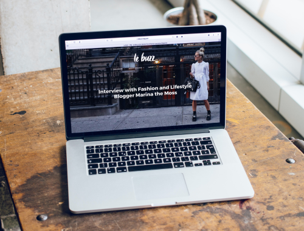

# Portfolio Site Step-By-Step Guide  
Hello and welcome to this workspace. This page is your step-by-step guide into making a simple portfolio site. To start you off, we created an index.html page and already linked it to the stylesheet (style.css) for you. Additionally, there is also a reset.css file which we used to override the browser's default style. There are also images that you can use in the images folder. After the workshop feel free to replace it with your own photos. Enjoy!

_Written by Angie and Hun @ GDSC USyd Web-Dev 2023_

# Steps

## 1. Let's begin by laying down the skeleton 🩻!

  ### 1.1 Basic structure
   1. In the index.html file, you can see that there are already some html included. One of them is the **body tag**. This is the container that your html page will be in.
   2. On the **index.html** page, inside the **body tag** insert the **header tag**. This is the container that our navigation bar will be in!
   ```html
   <body>
    <header></header>
   </body>
   ```
  2. Below the **header tag**, insert a **main tag**. This is where the main content of our page will be included.
     ```html
     <body>
      <header></header>
       <main></main>
     </body>
     ```
  3. Finally, below the **main tag** insert a footer tag. This is where the footer of your page will be in (some additional info that will be included at the bottom of each page)
     ```html
     <body>
      <header></header>
      <main></main>
       <footer></footer>
     </body>
     ```
  4. This basic structure will be found across all pages of this demo. Continue onto making the navigation bar!

  ### 1.2. Navigation bar 🧭
  1. Inside the **header tag**, insert a nav tag. This is going to be your navigation bar!
  2. Think of a navigation bar, what does it contain? It usually contains hyperlinks (things you can click that will take you to different pages in the website). This can be achieved by inserting an **a tag**.
  3. Let's give that a try, plaste this in your workspace
     ```html
      <a href="sample.html">Sample</a>
     ```
     Refresh the preview of your page by pressing the big green button "Run". You'll see a blue, underlined text, Sample, show up on your page. Clicking on it should take you to the page outlined by the sample.html file.
  4. Replace that sample **a tag** with the following chunk of code inside your **nav tag**
     ```html
     <a id="logo" href="index.html">Jane Doe</a>
      <div id="nav_to_pages"> 
       <a href="#about_me">About</a>
       <a href="project.html">Project</a>
       <a href="contact.html">Contact</a>
      </div>
     ```
     What the heck are these?!?! No worries, I'll slowly go through them with you 😌
     - The first line contains a link to the current page (home page), this makes more sense when you're on another page and would like to go to the home page.
     - I gave it an id of "logo" and grouped the rest of the links to other pages inside a div container with id "nav_to_pages". Why? You'll see why soon...
     - If you click the links (except for the one with link to the current page), your browser will give you an error because those pages do not exist (yet 👀)
  5. Right now the navigation elements don't look so chic. Let's head onto our stylesheet (style.css) to fix this!
  6. Ok so, I want to make it so that the logo is bigger and bolder! Also, maybe add more space between each letter and get rid of the ugly underline for stylistic purposes 💅 Alright, let's "select" the **a tag** inside the style.css file.
     ```css
      a {
        font-size: 2rem;
        color: #212121;
        letter-spacing: .2rem;
        font-weight:700;
        text-decoration: none;
      }
     ```
     You'll notice that all the links' size are increased and they are the same. But... I want the links that are not the logo to be smaller. How do we do that?!
  8. If you remember, I gave an id to the a tag that is meant to be our logo. This was not applied to the other links. Let's change the above style rule for the a tag and insert a new selector for the a tag with id "logo".
     ```css
      a {
        color: #212121;
        letter-spacing: .2rem;
        font-weight:700;
        text-decoration: none;
      }
      
      #logo {
        letter-spacing: .3rem;
        font-size: 2rem;
      }
     ```
     You'll see that only the a tag with the id of "logo" is bigger than the rest of the links!
  9. It's looking a lot better but now I want the style the navigtion bar so that the logo is on the left and the the rest of the links should be to the right. Enter Flex box!
  10. There are many display options that you can give to a container. For our purpose, I will set the display property of the nav tag to flex. You can read more about each property that I used [here](https://css-tricks.com/snippets/css/a-guide-to-flexbox/).
  ```css
  nav {
    display: flex;
    /*creates a space between each element evenly*/
    justify-content: space-between;
    /*items are centered in the cross-axis*/
    align-items: center;
  }
  ```
  After applying the rule above, you should see that the logo stays on the left while the rest of the links moved to the right side of the page.

  11. Each link on the right seems to be too close to each other. This is bad for readability! Let's add a rule which makes more space between each of them. Below, the selector is selecting a tags within containers with an id of nav_to_pages. This is so that it doesn't effect the logo (which is also an a tag element).
  ```css
    #nav_to_pages a {
      margin-left: 2.5rem;
    }
  ```
  This rule makes it so that every #nav_to_pages element has a barrier the size of 2.5 rem to its left from every other object.
  
  13. To make the top of our page look better, let's create more space between the navigation bar and the border of the page. We can set the padding of the navigation bar itself, but I will be doing it to the body tag instead (this is useful for when we lay down other elements inside the body, so the spacing is consistent)
  ```css
    body {
      padding: 40px 60px;
    }
  ```
  14. Let's change the font too! Go to [Google Fonts](https://fonts.google.com/). This site has a bunch of fonts that you can use. In your own time you can experiment with different fonts, but for now let's stick to Roboto. In the head tag at the top of the index.html file, not the header tag, insert the following...
  ```html
  <link rel="preconnect" href="https://fonts.gstatic.com" crossorigin>
<link href="https://fonts.googleapis.com/css2?family=Roboto:wght@400;700&display=swap" rel="stylesheet">
  ```
  Then in your style.css, add the following to your body tag.
  ```css
  body {
    font-family: 'Roboto', sans-serif;
    color: #212121;
    padding: 40px 60px;
  }
  ```
  We set the Roboto font to the whole page. Additionally, I also set the color of every text to the same dark-grey that we used before by specifying the rule inside the body tag. 

  15. Now let's add an element of interactivity. Think about when you're interacting with a button or something clickable on a webpage, usually it transform from its original look to indicate that it is be interacted with. We can do this very easily using css state selector.      
  ```css
    a:hover {
      color: #8c8c8c;
    }
  ```
This rule makes it so that on hover the hyperlink will change colour. This is a good style convention to have.

  16. And that's it for the navigation bar, good job!


### 1.3. Footer 🐾
1. Most websites has a footer, or a section of content at the very bottom of a web page. It could contain privacy policy, sitemap, social media icons, etc. For our purpose, we'll add links to our socials.
2. In the footer tag of the index.html file, insert...
   ```html
    <h2>Want to get in touch?</h2>
    <div class="social_icons">
      <!-- feel free to replace the links to your own socials later -->
      <a href="https://www.instagram.com/gdscusyd/" class="social_icon">Instagram</a>
      <a href="https://www.linkedin.com/company/gdsc-usyd/" class="social_icon">LinkedIn</a>
      <a href="contact.html" class="social_icon">Contact</a>
    </div>
   ```
   Have a look at the preview of your page, you can see that there is a title and three hyperlinks. There's a lot of issues with how it looks right now!
   - the footer is so closer to the navigation bar!
   - there should be more space between the heading and the rest of the links
   - there should be more space between each links
   - the heading should be bigger

5. Let's add some space between the footer and the contents above it. Insert the following to the style.css file.
   ```css
   footer {
      margin-top: 100px;
    }
   ```
   That looks a lot better now! But there's still more work to do 💪

4. By default, the title as defined by h2 should be bigger than normal paragraph texts, but we have used a reset.css file which overrides the default styles given by the browser. It is up to us to set the size ourselves. We should also add some space between the heading and the links below it. Insert the following rule in your style.css
   ```css
   h2 {
    font-size: 1.5rem;
    margin-bottom: 1rem;
    font-weight:700;
   }  
   ```
5. Now let's add spacing between each link. If you notice in your index.html file, each a tag has a class "social_icon". Inside the style.css file, add the following...
   ```css
   .social_icon {
      margin-right: 30px;
    }
   ```
   This rule specifies that every element which has class "social_icon" will have a barrier of size 30px to its right, away from other elements.

6. And with that, we're done making the footer!

## 2. Creating other pages from the skeleton 📚
Now that we have created the common elements that will be seen across each page of our website, we can just copy and paste the HTML from index.html to other pages!

1. On the left tab, you can click a "New File" icon to add a new file. Create one called "contact.html" and "project.html".
2. Copy the content of the index.html and paste it inside contact.html and project.html. Change the content of the title tag on each page to match the name of the page. e.g.
   ```<title>Contact</title>``` and ```<title>Projects</title>```
4. All of the links in the navigation bar (except for About) should work now!

## 3. Let's finish up the Home page 🏠
### 3.1. Hero Section 🦸
What is a hero banner? It usually includes a large image at the top of your website's homepage. The purpose is to give the viewer a quick glimspe into what your website is about. You can get creative with your hero banner! Today we're sticking with a simpler one.

1. In index.html, paste the chunk of html below in the main tag
   ```html
   <section class="text_and_image_content">
      <div>
        
      </div>
      <div class="intro_text_container">
        <h1>Hello!</h1>
        <h2>I’m Jane, a third year software engineering student.</h2>
        <h3>Welcome to my portfolio site! Here you can find out more about me and my projects.</h3>
      </div>
    </section>
   ```
   We're using a section tag to put this content, because well, it is a section on our page. I gave it a class name of "text_and_image_content", once again this is to help me with styling the container.
   - You'll notice that we have included an img tag. This is a tag which allows you to include a photo. In this case we are giving the source attribute of the img tag the relative path to a photo stored in our file directory.
   - Below that is another div container which contains our introductory texts. We use different levels of heading to show different level of importance.
2. We can see that there are a lot of imporvements that we can make to the hero banner 😓 First of all, let's set the size of the h1 tag (remember, we used a reset.css file which override default styling of the browser). In style.css, insert the rules below.
   ```css
   h1 {
    font-size: 2.5rem;
    font-weight:700;
    }
   ```
3. Let's add more styling to the texts in this section. I would like to make it so that each of the heading tag have more spacing inbetween letters. Another way of selecting multiple HTML element in the CSS file is to list them. See how much easier on the eye it is now that there is more space between each letter. This is especially important when you have long paragraphs of small-sized texts.
   ```css
    h1, h2, h3 {
    letter-spacing: .2rem;
    margin-bottom: 1.5rem;
    }
   ```
4. Additionally, I want to go fancy and make it so that the sub-subtitle has a different colour. We can do that easily by selecting the h3 tag like below. I set it to a lighter grey that is still readible (is this a word? 🤔). This lessens the focus on the texts of h3, which is good because you don't want to bombard the user with too much!
   ```css
    h3 {
      color: #666666;
    }
   ```
5. Alright, now we can get to formatting the structure of this section. You can leave it like this if you want, but I think we can make the design even more refined. First thing first, let's create more space between the header and the main section. In style.css, insert the rule below.
   ```css
   header {
      margin-bottom: 100px;
    }
   ```
6. Now, let's format the section so that the image floats to the left of the page and the texts are to the right. Insert the rules below into style.css
   ```css
   .text_and_image_content {
      display:flex;
      justify-content: space-between;
      align-items: center;
      gap: 100px;
    }
   ```
   The texts spread quite long horizontally. We can set it's width relative to the parent container! Now the texts should only take up 50% of the space. 
   ```css
    .intro_text_container {
      width: 50%;
    }
   ```
7. Awesome, it's looking even better! But if you notice on screens larger than 1500px horizontally, the image and the texts spread too far away from each other. There's a very easy fix for this! You can simply give the section container a maximum width. I'm applying it to main instead so that the size of the sections can be consistent.
   ```css
    main {
      max-width: 1000px;
    }
   ```
9. Buttttt we have a problem, now the section is sticking to the left side of the page 😢 (Actually it does look pretty cool this way, but it's not the original design the team had in mind!). Once again, it's a very easy fix. Remember our good friend, margin? The below styling is a great tip for centering an element vertically. In addition to setting the max-width of the main tag, let's edit its margin.
  ```css 
  main {
    max-width: 1000px;
    margin-left:auto;
    margin-right:auto;
  }
  ```  
If you apply the rule above, you'll see that this section stays in the centre of the page and still looks great even at screen dimension larger than 1500px (horizontal). 

10. Let's do something fun with the img tag. There's many things that you can do to it, one of them is adjusting its border radius (same goes for other containers). 
    ```css
    img {
      width:100%;
      border-radius: 5%;
    }
    ```
  Try setting the border-radius higher, what happens to the image!? (btw we set the width of the img to 100% so that it scales to the size of the page)
  

### 3.2 About me 👾
An about me section is pretty important. You can introduce yourself to the visitor of your site. Previous section was pretty involved, but this one is very chill I promise!

1. So... about me is another section, so we use a section tag once again! In index.html, inside the main tag but below the hero banner that we created, insert the following HTML.
   ```html
    <section id="about_me">
      <h2>About me</h2>
      <!-- feel free to replace the placeholder texts below later -->
      <p>
        Lorem ipsum dolor sit amet, consectetur adipiscing elit. Morbi quis mauris laoreet, semper lorem a, lobortis magna. In dignissim ipsum nec nisi tempor condimentum. Nullam mollis felis et porttitor mollis. Vivamus varius eget magna quis rutrum. Donec mattis tincidunt elit, eget rhoncus leo aliquet euismod. Cras euismod metus eget ornare molestie. Etiam consequat enim nec nibh sagittis condimentum. Proin consectetur auctor turpis ac vehicula. Vivamus tempus mauris ex, quis efficitur purus malesuada in. Cras condimentum est et mi vulputate, in vulputate dolor placerat.
      </p>
    </section>
   ```
   We used a h2 tag as a header. Since we already defined its size and style previously, it also applies to this particular heading. A new friend we have here is the p tag, which is where paragraph texts usually go to.
3. Oh no, the two sections are too close to each other! We can easily fix this by selecting the section tags in your style.css and adjusting its margin. The below rule ensures that anything below a section is at least 200 px away from it.
  ```css
  section {
    margin-bottom: 200px;
  }
  ```
3. Now, wouldn't this look better if the texts are centered? Once again, a very easy thing to do :) In your style.css, insert the following rule. Notice I didn't put the text-align rule inside the section selector from the above step. This is so that it doesn't interfere with our hero banner!
   ```css
      #about_me {
        text-align:center;
      }
   ```
4. If you notice, the paragraph of small texts are so close to each other. It's hard to read and not pleasing to the eyes. Let's apply the rules below which increases the spacing between each line and between each letter itself.
   ```css
    p {
      letter-spacing: .1rem;
      line-height: 1.6;
    }
   ```
5. If you remember from when we created the navigation bar, the About Us links to a #about_me. It's not a page in our website or externally. So what is it? Well, it's just linking to an element on our website which has the id of "about_me". Try clicking the About link, see what happens.
6. Great job everyone, we're done with making the Home page 🎉!!!

## 4. Project Page 🎬

Everything's going great so far! Now, we just need to make a project page, but don't worry, it shouldn't be too difficult. We've already made the index.html file, which we can use as a starting point for the project page. We'll just need to reuse some of the HTML and CSS code we already have. 😁

### 4.1. Starting structure for project.html

"🎉 Great news! Since we already created the project.html file earlier, you can use it as a starting point for your structure. This should help you get started on the right track. 👍
```html
<!DOCTYPE html>
<html>

<head>
  <meta charset="utf-8">
  <meta name="viewport" content="width=device-width">
  <title>Project</title>
  <link href="reset.css" rel="stylesheet" type="text/css" />
  <link href="style.css" rel="stylesheet" type="text/css" />
</head>

<body>
  <header>
    <nav>
    <a id="logo" href="index.html">Jane Doe</a>
      <div id="nav_to_pages"> 
       <a href="#about_me">About</a>
       <a href="project.html">Project</a>
       <a href="contact.html">Contact</a>
      </div>
  </nav>
  </header>
  <main>
  </main>
  <footer>
    <h2>Want to get in touch?</h2>
    <div class="social_icons">
      <a href="https://www.instagram.com/gdscusyd/" class="social_icon">Instagram</a>
      <a href="https://www.linkedin.com/company/gdsc-usyd/" class="social_icon">LinkedIn</a>
      <a href="contact.html" class="social_icon">Contact</a>
    </div>
  </footer>
  <script src="script.js"></script>
</body>
</html>
```
### 4.2. Navigation bar 🧭

One of the great benefits of using classes in your HTML and CSS code is the ability to easily reuse styles that you've already created. By defining and applying classes to your elements, you can save time and effort by not having to recreate the same styles over and over again for each section or project. So, let's take advantage of this helpful feature! 🙃

1. Let's change #about_me to index.html#about_me

If the "about_me" section is on the same page as the link that refers to it, you can use "#about_me" in the link's URL to navigate directly to that section. But if the "about_me" section is on a different page, you need to include the page name in the link's URL followed by "#about_me" to ensure that it navigates to the correct section on that page.
```html
   <header>
    <nav>
    <a id="logo" href="index.html">Jane Doe</a>
    <div id="nav_to_pages"> 
     <a href="index.html#about_me">About</a>
     <a href="project.html">Project</a>
     <a href="contact.html">Contact</a>
    </div>
  </nav>
  </header>
  ```
### 4.3 Projects 📗📘📙

We will be creating two paragraphs and pairing them with complementary pictures on either side. You might recognize this technique from index.html, and you're correct🤩 - we are going to employ the hero section from index.html in our project.html.

1. But first, let's write a heading 'Project' under our main tag.
  ```html
  <main>
    <h1 id="project_heading">Projects</h1>
  </main>
  ```
  ```css
  #project_heading {
  margin-bottom: 80px;
}
  ```
We used margin-bottom: 80px; in our CSS to add a space of 80 pixels between the project section and the one below it. This makes the sections look more distinct and less cluttered.

2. Great! Now let's incorporate the same hero section that we used on the index.html page and add under our heading.
```html
  <main>
    <h1 id="project_heading">Projects</h1>
    <section class="text_and_image_content">
      <div>
        
      </div>
      <div class="intro_text_container">
        <h1>Hello!</h1>
        <h2>I’m Jane, a third year software engineering student.</h2>
        <h3>Welcome to my portfolio site! Here you can find out more about me and my projects.</h3>
      </div>
    </section>
```
3. We can use the existing CSS styles from the previous project section, but modify the HTML structure to match our new design.
```html
 <main>
    <h1 id="project_heading">Projects</h1>
    <section class="text_and_image_content">
      <div class="intro_text_container">
        <h2 class="project_sub_heading">Lorem ipsum</h2>
        <p>
          Lorem ipsum dolor sit amet, consectetur adipiscing elit. Morbi quis mauris laoreet, semper lorem a, lobortis magna. In dignissim ipsum nec nisi tempor condimentum. Nullam mollis felis et porttitor mollis. Vivamus varius eget magna quis rutrum. 
        </p>
      </div>
      <div>
        
      </div>
    </section>
```

we have...

- Swapped the position of the image and text.
- Removed the h1 and h3 tags as they are not needed.
- Added a new class called project_sub_heading for our subheading.
- Added a p tag for a short paragraph to explain our project.
- Changed the image source and corresponding name to match.

```css
.project_sub_heading {
  margin-bottom: 30px;
}
```
Again, We added margin-bottom to the project_sub_heading class in our CSS to create space between our heading and paragraph, ensuring the section is easier to read. 🤝

4. One project looks kinda empty... let's add another one below.

```html

```
To modify the second project, all you need to do is change the image tag in its HTML code to display a different image.😊

Great job! Your project page is now complete. It's worth noting how useful using classes can be, as they allow you to reuse the same styles over and over again whenever you need them. Now we are moving on to contact.html. 😎😎😎
   
## 5. Contact Page ☎️

In this section, we will be creating the layout for a contact form using HTML and CSS. However, we will not be implementing the functionality of the form at this time as that requires the use of JavaScript 😉 

### 5.1. Starting structure for contact.html

👉 To get started with your contact.html file, we will use the same structure. Make sure to include this structure in your contact.html file, and if you haven't already, here's what it should look like. 👀 
```html
<!DOCTYPE html>
<html>
<head>
  <meta charset="utf-8">
  <meta name="viewport" content="width=device-width">
  <title>Contact</title>
  <link href="reset.css" rel="stylesheet" type="text/css" />
  <link href="style.css" rel="stylesheet" type="text/css" />
</head>

<body>
  <header>
    <nav>
    <a id="logo" href="index.html">Jane Doe</a>
      <div id="nav_to_pages"> 
       <a href="#about_me">About</a>
       <a href="project.html">Project</a>
       <a href="contact.html">Contact</a>
      </div>
  </nav>
  </header>
  <main>
  </main>
  <footer>
    <h2>Want to get in touch?</h2>
    <div class="social_icons">
      <a href="https://www.instagram.com/gdscusyd/" class="social_icon">Instagram</a>
      <a href="https://www.linkedin.com/company/gdsc-usyd/" class="social_icon">LinkedIn</a>
      <a href="contact.html" class="social_icon">Contact</a>
    </div>
  </footer>
  <script src="script.js"></script>
</body>
</html>
```
### 5.2 Now we are going to create a contact form 🥳

1. To create a form element, it is necessary to use a pair of form tags - an opening form tag and a closing form tag. The form tags act as a container that holds all the content inside them.
```html
  <main>
    <form>
    </form>
  </main>
```
2. Just like we did on the Project page, we're adding a "Contact me" heading and a short text under it using the ```<p>``` tag.
  ```html
  <main>
    <form>
      <h1>Contact me</h1>
      <p>I would love to hear from you! Please fill in the form below with relevant
        information.
      </p>
    </form>
  </main>
```
3. Let's add id on both h1 and p tag to apply styles to them.
  ```html
     <h1 id="contact_heading">Contact me</h1>
      <p id="contact_paragraph">I would love to hear from you!
  ```
4. Our next step is to add styles to the h1 and p tags that we just created. We will use the corresponding IDs to target these elements and add the necessary styles.
 ```css
#contact_heading {
  font-size: 2rem;
  text-align: left;
}

#contact_paragraph {
  font-size: 15px;
  text-align: left;
  margin-bottom: 30px;
}
```
#### #contact_heading 

🟠 We'll use a font size of 2rem as a starting point.

🟠 "The 'text align-left' option aligns text to the left side of a page. In our case, since our ID lies within a form tag that has a maximum width of 700px, the text will align to the left within that range."

#### #contact_paragraph

🟠 To differentiate the text size from the heading, we'll make it smaller by using a font size of 15px. (By the way, 1 rem is equal to 16 pixels.😄 I'll use "px" to show that font size can be varied in multiple ways.)

🟠 We added margin-bottom to create space between our heading and paragraph, ensuring the section is easier to read. 🤝

5. Creating basic form structure

The next step is to add an input element inside the form, which allows the user to input their information. The type attribute of the input element can be set to "text" to allow the user to enter any text information, such as their name.  Now you can see have a box 🙂.

But a text box alone may not guide the user to input the correct information. That's where a label comes in! Let's call it "Name:"
```html
<form>
   <label>Name: </label>
   <input type="text">
</form>
 ```
6. Adding more fields🏟️
   
Let's add more fields to our contact form, such as email, subject, and message, using the same elements we used for the name field. But for email, we will add email as our type instead of text because it allows the browser to validate that the input is a properly formatted email address. This helps to reduce errors and ensure that we receive the correct information from the user.
```html
<form>
   <label>Name: </label>
  <input type="text">
  <label>Email:</label>
  <input type="email">
  <label>Subject:</label>
  <input type="text">
  <label>Message:</label>
  <input type="text">
</form>
 ```

6. Button🌲

So, we've created our contact form but how are we going to send this information?🤔 That's where the submit button comes in. We can add a button tag with the text "Submit" inside. The button's type attribute determines its behavior when clicked, and there are multiple types to choose from depending on the intended use.🎉🎉
```html
   <button type="submit">Submit</button>
```
7. Introduction to <textarea>

Okay now it kinda seems like a form now but message box seems a bit too small.😅 this is because <input> tag is used for single-line text input. In this case, we want the user to be able to input a longer message, so we use the <textarea> tag for multi-line text input.
```html
<label>Message:</label>
<textarea></textarea>
 ```
8. Styling form 
Now that we have all the necessary elements in our contact form, we can start styling it using CSS to make it visually appealing and user-friendly. 😎😎

currently without any CSS, the contact form appears cluttered and lacks structure. To improve the appearance of the form, we can add some CSS styling to give it a more organized and visually appealing layout.😊
```css
form {
  max-width: 700px;
  margin: 0 auto;
  display: flex;
  flex-direction: column;
}
```
Remember how we set a maximum width of 700px for our #contact_heading?

🟠 We'll set the max-width property of the form to 700px to align it with the heading, which we also set to 700px, and keep everything organized within a specific width limit.🤝

🟠 Setting margin: 0 auto; for our form is a quick way 💨 to create equal spacing around it and center it. It sets the top and bottom margins of an element to 0, and the left and right margins to "auto". You could use individual margin properties for the same result, but this is a quicker version.🫡

🟠 Using display: flex; in your form 📝 allows you to position and align form elements flexibly. By default, it arranges elements in a row from left to right, but adding flex-direction: column; 📏 changes it to a vertical layout from top to bottom, making the form easier to read and maintain. 🙌


9. Styling label 
```css
label {
  font-family: 'Roboto', sans-serif;
  display: block;
  font-size:20px;
  text-align: left;
  color: #666666; 
  margin-bottom: 10px;
}
```
🟠 font-family: 'Roboto', sans-serif; We will continue using the same font. 🌟

🟠 font-size:20px; sets the font size of the label to 20 pixels, making it large enough to be easily readable but not so large as to be overwhelming. 📏

🟠 text-align: left; aligns the text of the label to the left, which is the default alignment for most languages. This makes the label text easier to read and more accessible. 🔍

🟠 color: #666666; sets the color of the label text to a dark gray, which is easy on the eyes and provides good contrast against a white background. 🎨

🟠 margin-bottom: 10px; adds a 10-pixel margin to the bottom of each label, creating some visual breathing room between the label and the form field below it. This helps to make the form easier to read and use. 👌


9. Styling input & textarea
   
```css
input[type="text"], input[type="email"], textarea {
  font-family: 'Roboto', sans-serif;
  width: 100%;
  padding: 10px;
  border: none;
  background-color: #f2f2f2;
  border-radius: 8px;
  margin-bottom: 20px;
  font-size: 16px;
  text-align: left;
}
```
woah why did you add input[type="text"] instead of just input? 🤨

Well, you can use just 'input' if you want to apply the same styling to all input elements within your form, regardless of their type attribute. But this way we can target specific types of input elements. 🤩

🟠 Setting the width of our input fields to 100% ensures that they stretch to fill the entire width (700px). 📱

🟠 For a better look, we'll add some padding to our input fields using padding: 10px;. This gives some space between the text and the border of the input field. 📝

🟠 Removing the border on our input fields using border: none; gives them a clean and modern look. 🎨

🟠 Adding a border-radius of 8px to our input fields gives them rounded corners and adds to the modern look of the form. 📏

🟠 Setting a margin-bottom of 20px gives some space between each input field, making the form easier to read and use. 📏

🟠 Aligning the text to the left using text-align: left; makes it easier for users to read and enter information in the input fields. 📝

10. More on textarea

```css
textarea {
  height: 200px;
  resize: vertical;
  border-radius: 8px;
}
```
🟠 The height property sets the height of the textarea element to 200px, which 

🟠 The resize: vertical; property allows the user to resize the textarea vertically, meaning they can drag the bottom edge of the textarea up or down to increase or decrease its height.

10. Styling button 
```css
button[type="submit"] {
  background-color: #87CEEB;
  color: white;
  padding: 12px 20px;
  border: none;
  border-radius: 8px;
  cursor: pointer;
  font-size: 16px;
  align-self: flex-start;
}
```

🟠 To style our submit button, we use the button[type="submit"] selector.

🟠 We set the background color to #87CEEB and the font color to white to create a clear contrast and make the button stand out. 🎨

🟠 Padding of 12px on the top and bottom and 20px on the left and right adds space around the button's text, making it easier to read and click. 📏

🟠 We remove the button's border using border: none; to create a clean and modern look. 🚫

🟠 To make the button interactive, we set cursor: pointer; so that it changes to a hand pointer when the user hovers over it. 👉🏼

🟠 We set the font size to 16px and align-self: flex-start; to move the button to the left and align it with the rest of the form elements. 🤝


11. More on button
```css
button[type="submit"]:hover {
  background-color: #44626e;
}
```

🟠 When a user hovers their mouse over our submit button, we want to give them a visual indication that the button is clickable. To do this, we use the button[type="submit"]:hover selector.

🟠 We set the background color to #44626e on hover, which is a slightly darker shade of the blue-green color we used for the button's normal state.

🟠 By changing the background color on hover, we make the button feel more interactive and give users a clear indication that they can click it to submit the form.


 <Optional part> - depends on time and ability 
   
12. More attributes on form
    
```html
<form action="" method="POST">
        <label for="name">Name:</label>
        <input type="text" id="name" name="name" placeholder="name" required>
        <label for="email">Email:</label>
        <input type="email" id="email" name="email" placeholder="Email" required>
        <label for="subject">Subject:</label>
        <input type="text" id="subject" name="subject" placeholder="Subject" required>
        <label for="message">Message:</label>
        <textarea id="message" name="message" rows="8" cols="50" placeholder="message" required>    </textarea>
        <button type="submit">Submit</button>
      </form>
```

🟠 It's a good practice to include the 🔍 for attribute in the 🔖 <label> element and set it to a unique identifier, let's say "fname". Within the associated 🔍 <input> element, I will set the id attribute also equal to "Name:". This makes it easier for users to navigate the form and for screen readers to read the labels.

🟠 There is also a 📝 name attribute for the 🔍 <input> element. This is used to give a name to the data that is submitted. Think of it like a variable name. In this case, I will also name it "fname".

🟠 The ✅ required attribute is a boolean attribute that can be added to any 🔍 <input> element. If it's set to "required", users must fill out that field before they can submit the form. If they attempt to submit without filling out the required fields, a pop-up box will appear prompting them to fill it out.

🟠 Additionally, there is a 🌅 placeholder attribute that can be added to the 🔍 <input> element. It displays some default text to the user, such as "write your name", until they click on the input field and begin typing.

🟠 To send the data to a page, we need to specify the page in the 🎬 action attribute of the 📋 form element. In this example, we have left the action attribute empty because we are not focusing on functionality, but rather the structure of the form. (we also don't have ther server.) The action attribute is used to specify the URL of the page that will receive the form data when the form is submitted. If you have a server-side language like PHP or ASP, you can use it to process the form data and take appropriate action. However, for demonstration purposes, we have left the action attribute blank.

🟠 There is also a 📩 method attribute that can be set to either "GET" or "POST". "GET" is considered insecure because it appends the data to the URL of the web page, which is visible to anyone. "POST" is more secure because it doesn't display the data in the URL. It's best to use "get" for things like search boxes, but for submitting secure information like passwords, "post" is a better option.


## Andddd we're done! 🥳
Thank you for participating in our workshop. We hope that you've learned the basics of HTML + CSS and was able to make a pretty cool deliverable. If you would like to learn more, resources like W3School and CodePen is great. But... if you're curious about JavaScript you can come along to our second workshop as well! (More details to be released) 
### Extra
You'll notice that our contact form doesn't work. Without knowing how to set up the backend to make this work (it gets quite complex), you can find alternative form backend API to help you do this. We recommended [Formspree](https://formspree.io/) 